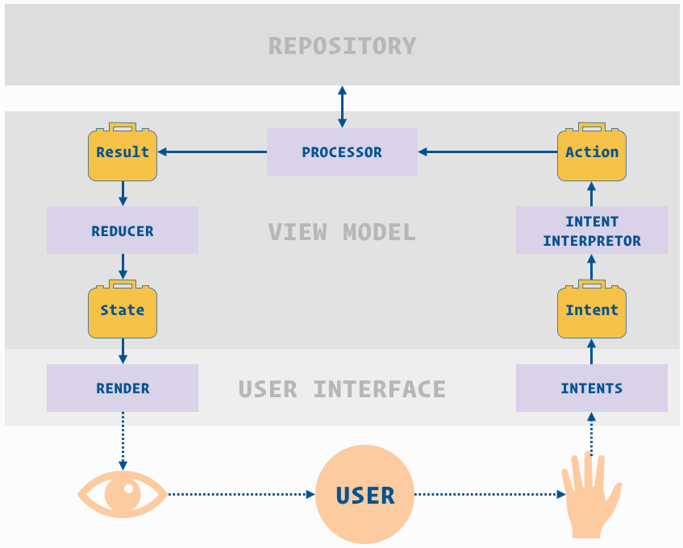

# HotWheels
> Small project used for demonstrating how MVI and MVP architecture looks.
> No architecture is good or bad over another, but rather one should be chosen by the
team considering the technical and business requirements.


## Development setup

- Clone the master branch of this repository and open it with your 
preferred IDE for android development.
- Kotlin plugin version to have - 1.3.21 or higher
- Gradle version to have - 4.10.1 or higher


## MVI architecture
> Study video - https://www.youtube.com/watch?v=PXBXcHQeDLE




The MVI architecture embraces reactive and functional programming. 
The two main components of this architecture, the View and the ViewModel
can be seen as functions, taking an input and emitting outputs to each other.

From a testing point of view this architecture has a very high testability 
rate. The business logic is totally decoupled and unit tests can be added easily
as well as integration tests which will take the intent and return the result
in a beautiful manner as present in this project

Maintainability - ease of amending or adding a feature - Side effects 
are restrained and since every part of the architecture has a well defined 
purpose, adding a feature is only a matter of creating a new isolated 
processor and plug it into the existing stream.

One downside of this architecture is the amount of code, but this can be 
easily mitigated by using kotlin.


## MVP architecture


- Note: MVP example is under progress. 

MVP is a natural derivation of the model–view–controller (MVC). While 
the business logic is separated, it's not fully decoupled, as the relation
between the view and presenter is one to one. There are many variations of
MVP and everyone can adjust the pattern to their needs and the way they 
feel more comfortable. It varies depending basically on the number of 
responsibilities that we delegate to the presenter. 

From a testability point of view it has a high testability rate. Alongside 
with the unit tests for individual classes, integration tests can be written
and mock the view interface in order to verify that a certain method has been called.
(i.e check if the presenter called the view method for displaying the loader)

Maintainability - relatively easy  depending on the approach taken for the
implementation.

One downside is the fact that there is a one-to-one relation between the view and presenter,
the presenter can become quite a huge class and do too much, but this can be
mitigated by splitting a screen into multiple views.


## Conclusions

As said above, there is no good or bad architecture. A team should 
discuss between each other and taking into account the technical and business
requirements, choose one architecture. 

One very important aspect is how productive the team would feel by selecting
the architecture and this should be one of the primary criteria of selection.

Personally I feel that MVI is more natural as it involves the user into it.
The data stream, the app interruptions have a natural way of starting, resuming
and stop. 
 
As there is a one-to-one relation between the view and presenter,
the presenter can become quite a huge class and do too much. 


## Dependencies

- [RxJava2](https://github.com/ReactiveX/RxJava)
- [RxBinding3](https://github.com/JakeWharton/RxBinding)
- [Dagger2](https://github.com/google/dagger)
- [Retrofit2](https://square.github.io/retrofit/)
- [Junit](https://junit.org/junit5/)
- [Mockito2](https://github.com/mockito/mockito)


## Meta

Distributed under the Apache license. See ``LICENSE`` for more information.

[https://github.com/arongeorgel](https://github.com/arongeorgel)

# License

```
Copyright 2019 Aron Georgel

Licensed under the Apache License, Version 2.0 (the "License");
you may not use this file except in compliance with the License.
You may obtain a copy of the License at

    http://www.apache.org/licenses/LICENSE-2.0

Unless required by applicable law or agreed to in writing, software
distributed under the License is distributed on an "AS IS" BASIS,
WITHOUT WARRANTIES OR CONDITIONS OF ANY KIND, either express or implied.
See the License for the specific language governing permissions and
limitations under the License.
```
